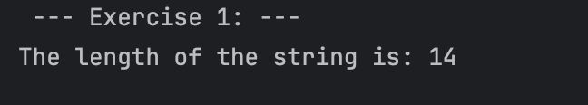
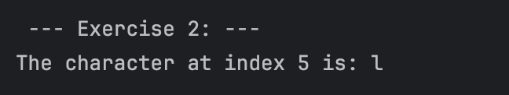
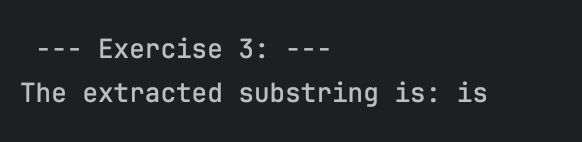
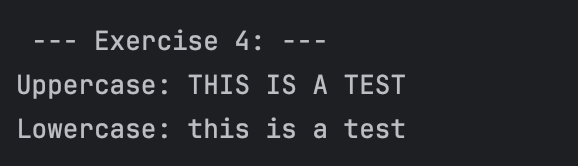
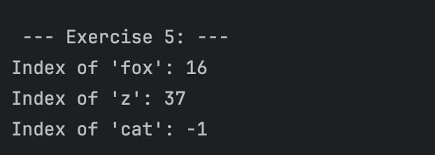
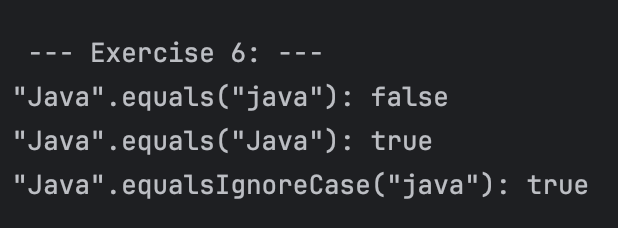
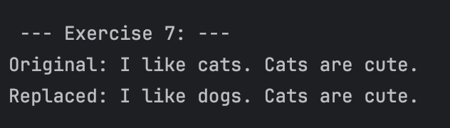
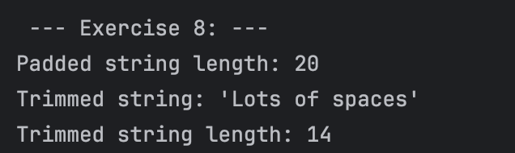

# Hands-on Lab: Exploring Java String Methods

---

## Lazaro, Cade Virgil C.

---

### Prediction:
Initially, I thought the program will output 13 since there were 13 characters inside the string.

### Observation: 
When I ran the program, it printed 14. I believe whitespaces are counted as characters so using .length will print 14.

---

### Prediction:
The program will print the letter "l".

### Observation:
I was able to predict the output of the program since I know .charAt() uses zero indexing, and the letter "l" is at index 5.

---

### Prediction:
The program will print the word "is".

### Observation:
The command .substring() uses zero indexing as well. The parameters used were (5,7), and since 
.substring subtracts 1 at the end index, it will print the word "is" without any whitespaces.

---

### Prediction:
The program will print both "THIS IS A TEST" and "this is a test".

### Observation:
The command .toUpperCase() will force the contents of the string to be all upper case letters. 
On the other hand, the command .toLowerCase() will print all lower case for the contents of the string.

---

### Prediction:
The program will print 16, 37, and -1. This is because using .indexOf(), will return
the index value of the first keyword within the string. it also prints "-1" if the keyword
is not found within the context of the string.

### Observation:
I was able to predict the output of the program.

---

### Prediction:
The program will print false, true, and true.

### Observation:
For str1.equals(str2), this will print false since the contents of the string do not match
in terms of cases. The letter "J" in java have different cases. Conversely, for str1.equals(str3) will print true
since they have the same cases for the letter "J". Using str1.equalsIgnoreCase(str2) will now print true
since we are telling the program to just look at the contents and disregarding and difference in cases.

---

### Prediction:
The first output will be the original message, but the second output will replace the word
cat with dog.

### Observation:
In this case, I was able to partially predict the output. I forgot that the program only replaces the
word that perfectly matches the given target, which in this case the word "cat" (letter "c" not capitalized).
The word "Cat" differs from "cat" in terms of capitalization so, the program only replaced "cat" with "dog".

---

### Prediction:
The program will print: 20, "Lots of spaces", and 14.

### Observation: 
This is because the original message have 20 characters inside the string (including whitespaces).
The program then trimmed the original message using .trim() which will eliminate
the whitespaces before the first letter and after the last. Printing the length of
the trimmed original message will now show 14 instead of 20, since the whitespaces were
removed.

